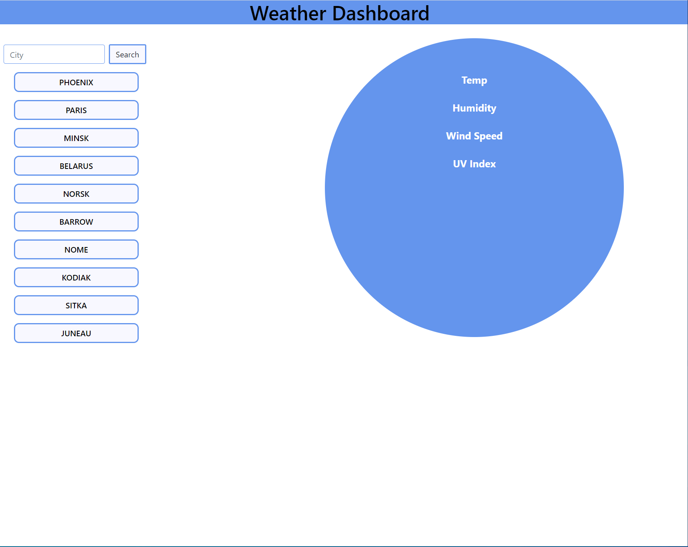
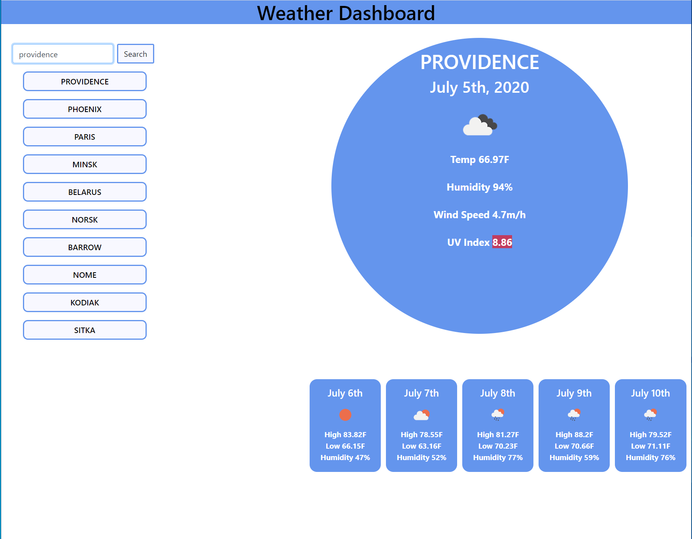

# City-Forecast
* GIVEN a weather dashboard with form inputs
* * WHEN I search for a city
* * THEN I am presented with current and future conditions for that city and that city is added to the search history
* * WHEN I view current weather conditions for that city
* * THEN I am presented with the city name, the date, an icon representation of weather conditions, the temperature, the *    humidity, the wind speed, and the UV index
* WHEN I view the UV index
* THEN I am presented with a color that indicates whether the conditions are favorable, moderate, or severe
* WHEN I view future weather conditions for that city
* THEN I am presented with a 5-day forecast that displays the date, an icon representation of weather conditions, the temperature, and the humidity
* WHEN I click on a city in the search history
* THEN I am again presented with current and future conditions for that city

https://essennejaye.github.io/city-forecast/

## Screenshots




## Code
````
function getData(cityName) {
    var apiUrl = "https://api.openweathermap.org/data/2.5//weather?q="
        + cityName + "&appid=d26f4f6b4558c822bbb01131aac44003";
    fetch(apiUrl)
        .then(function (response) {
            if (!response.ok) {
                alert("Weather for this city is not available");
                return Promise.reject(response);
            }
            else {
                return response.json();
            }
        })
        .then(function (response) {
            var weatherLon = response.coord.lon;
            var weatherLat = response.coord.lat;
            var apiUrlCoord = "https://api.openweathermap.org/data/2.5/onecall?lat=" + weatherLat
                + "&lon=" + weatherLon + "&exclude=hourly,minute&units=imperial&appid=d26f4f6b4558c822bbb01131aac44003"
            return fetch(apiUrlCoord);
        })
        .then(function (response) {
            if (!response.ok) {
                alert("Weather for this city is not available");
                return Promise.reject(response);
            }
            else {
                return response.json();
            }
        })
        .then(function (response) {
            var currentWeatherArray = [response.current.temp, response.current.humidity, response.current.wind_speed,
            response.current.uvi, response.current.weather[0].icon];
            displayCurrentWeather(cityName, currentWeatherArray);
            var dailyWeatherArray = response.daily;
            displayDailyWeather(dailyWeatherArray);
            savCities(cityName);
            loadCities();
        }).catch(function (error) {
            console.log(error);
        })
}
````